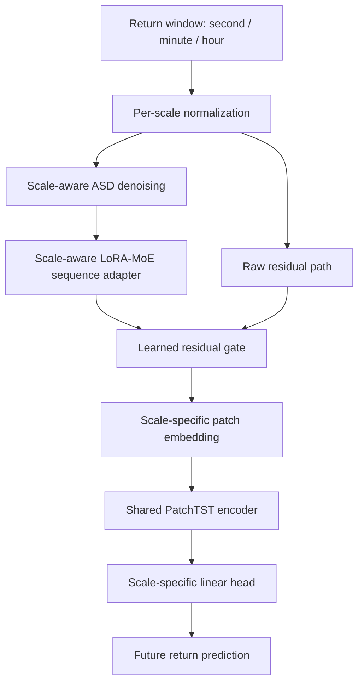

# PatchTST Optimization Teammate Handoff

这份交接只覆盖当前主线：优化 PatchTST 做 `second / minute / hour` 三尺度金融 return forecasting。旧的 FinCast position controller、trader、backtest、ETF daily 数据和 day-level 实验已经从当前代码主线移除。

## 1. 当前推荐模型

推荐作为统一三尺度主模型的是：

```text
return window
-> per-scale normalization
-> scale-aware ASD denoising
-> scale-aware LoRA-MoE sequence adapter
-> gated residual back to raw return input
-> scale-specific patch embedding
-> shared PatchTST encoder
-> scale-specific linear head
-> future return prediction
```

它在代码里对应：

- config: `configs/recommended_patchtst_main.json`
- runner: `scripts/evaluate_gated_pre_asd_32stock_multiseed.py`
- report: `report/gated_pre_asd_true_hour_60_30_10_h10.md`

注意：这里的 LoRA-MoE 是 pre-PatchTST 的 sequence adapter，不是早期讨论里简写的 post-PatchTST token adapter。这样做是为了先让输入序列做金融域和尺度适配，再交给共享 PatchTST 学 temporal pattern。

## 2. 架构图



## 3. 关键参数

| item | value |
| --- | --- |
| scales | `second`, `minute`, `hour` |
| cache | `data/cache/position_optiver_additional_true_hour_second_feature_cache_10stocks_512h.npz` |
| train stocks | 9 dense stocks: `0-8` |
| zero-shot stock | `9` |
| patch preset | `balanced_60_30_10` |
| target horizons | second: next `10` seconds; minute: next `1` minute; hour: next `1` true-hour step |
| second | context `60`, patch `10`, stride `5` |
| minute | context `30`, patch `5`, stride `2` |
| hour | context `10`, patch `2`, stride `1` |
| PatchTST | `d_model=64`, `n_heads=4`, `n_layers=2`, `d_ff=128`, `dropout=0.1` |
| LoRA-MoE | rank `8`, alpha `16`, experts `4`, top-k `2` |
| ASD | init gate `-4.0` |
| training | balanced multi-scale batches, seeds `42/43/44` |

## 4. 当前结果摘要

所有数字都是相对各自 raw PatchTST baseline 的测试集提升百分比，越高越好。

| model | second | minute | hour | decision |
| --- | ---: | ---: | ---: | --- |
| gated pre-ASD + LoRA-MoE | +0.33% | +0.12% | +3.01% | 当前最稳统一主模型 |
| post LoRA-MoE + head | +0.38% | -0.89% | +2.95% | hour 强，但 minute 不稳 |
| scale-specific gated pre-ASD MoE | +0.38% | +0.03% | +2.68% | 稳，但 hour 略弱 |
| multichannel ASD + LoRA-MoE | +3.21% | -0.42% | +3.83% | 候选模型，需进一步确认 |

结论：当前默认推荐仍是 `gated pre-ASD + LoRA-MoE`，因为它三个 scale 都没有明显伤害，并且 hour 有稳定收益。`multichannel ASD + LoRA-MoE` 潜力更高，但 minute 暂时略差，seed variance 也更大，所以先作为 challenger。

## 5. 怎么训练/复现

主模型复现：

```powershell
.\.conda-fincast\python.exe scripts\evaluate_gated_pre_asd_32stock_multiseed.py
```

The wrapper defaults to the additional-data true-hour cache, patch preset
`balanced_60_30_10`, and `--second-target-horizon-steps 10`. Older reports used
the 600-second bucket cache and/or a 30-second cumulative second-level target,
so rerun the wrapper before treating the 60/30/10 protocol as final evidence.

多通道候选复现：

```powershell
.\.conda-fincast\python.exe scripts\evaluate_multichannel_patchtst_multiseed.py
```

快速检查：

```powershell
.\.conda-fincast\python.exe -m py_compile src\baselines\patchtst_lora.py src\baselines\scale_aware_asd_patchtst.py scripts\evaluate_gated_pre_asd_32stock_multiseed.py scripts\evaluate_multichannel_patchtst_multiseed.py
```

训练方式是两阶段：

1. 先训练 raw PatchTST baseline。
2. 加载 raw checkpoint，冻结 PatchTST 主干，只训练 ASD、LoRA-MoE adapter、residual gate 和 scale-specific heads。

每个 optimizer step 同时取 `second/minute/hour` 三个 batch，三个 loss 平均，再加很小的 router balance penalty，避免 second 样本量压倒其他 scale。

## 6. Git 里不包含什么

以下内容不进 Git，需要本地或网盘单独传：

- `data/cache/`: Optiver cache 文件。
- `models/`: checkpoint。
- `outputs/`: 实验 CSV 和中间输出。
- `.conda-fincast/`: 本地 Python 环境。

如果队友只需要理解模型和复现实验，先读：

1. `README.md`
2. `configs/recommended_patchtst_main.json`
3. `report/TEAMMATE_HANDOFF.md`
4. `src/baselines/scale_aware_asd_patchtst.py`
5. `scripts/evaluate_gated_pre_asd_32stock_multiseed.py`
