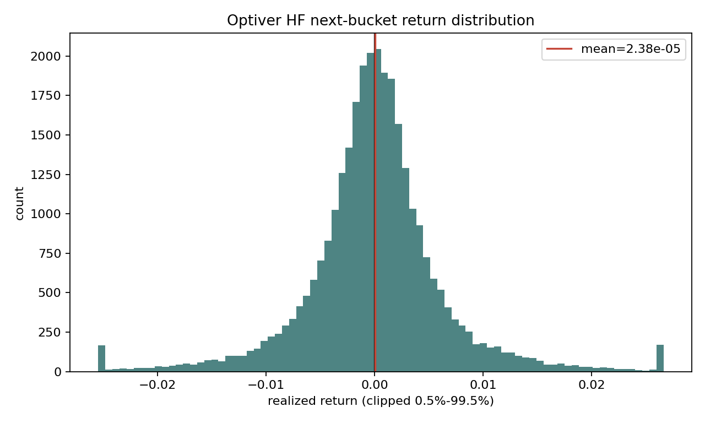
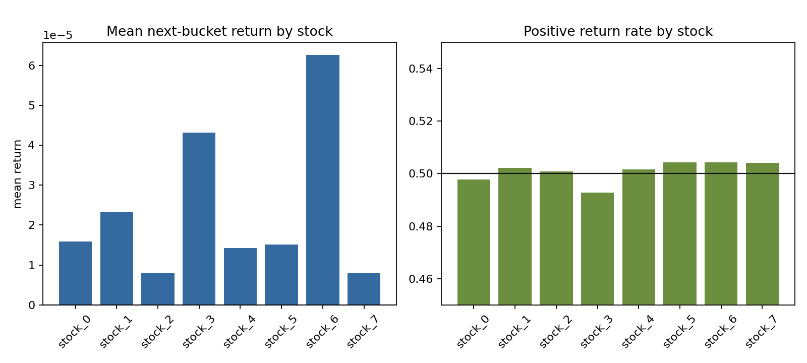
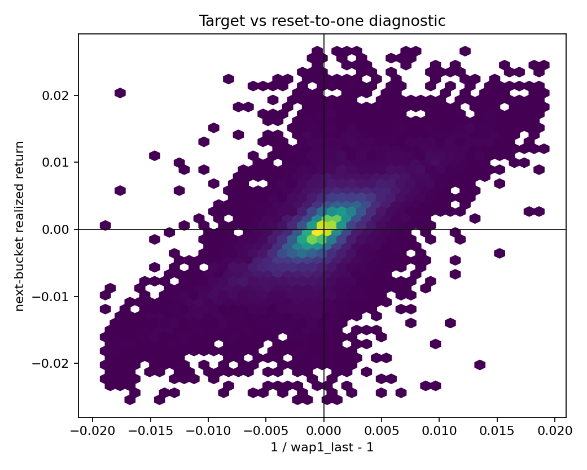
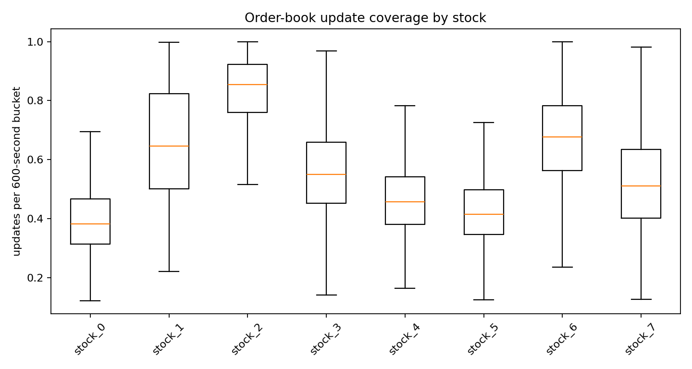
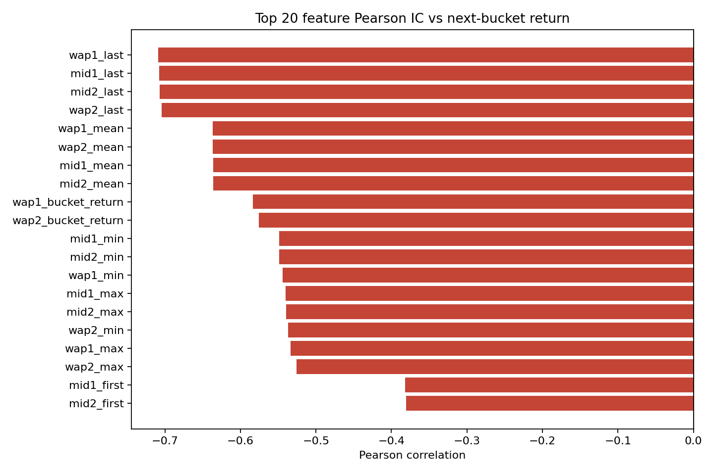
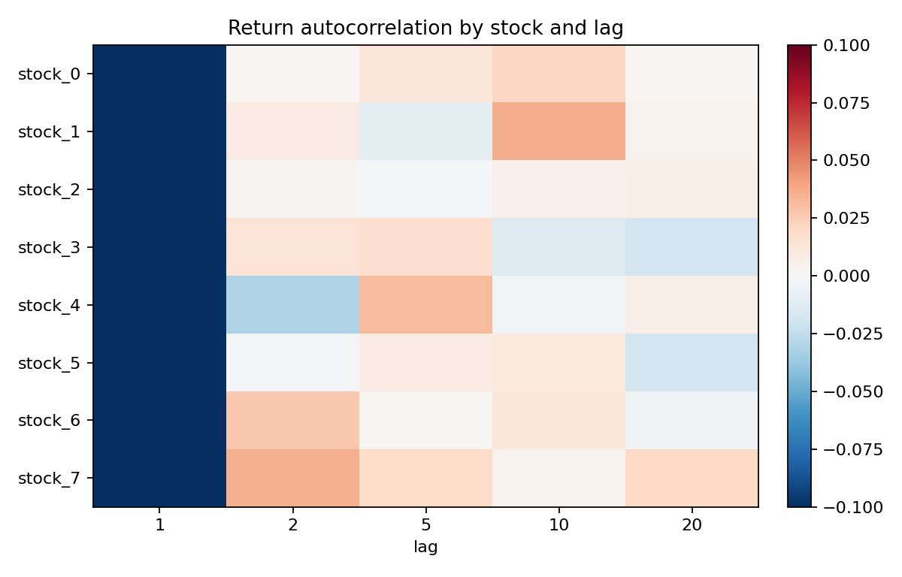

# Optiver 高频数据 EDA

生成时间：2026-05-21 11:21:06

## 数据来源与当前任务

- 使用 cache：`E:\Working Area\Comp5329_Assignment2_2026\data\cache\position_optiver_hf_feature_cache_8stocks.npz`
- source files：`8` 个 stock CSV
- 当前训练实际使用的是聚合后的 `time_id` 级别 engineered feature cache，而不是逐笔/逐秒原始行。
- 每一行样本表示一个 stock 的一个 `time_id` bucket；目标是下一 bucket 的 WAP return。

## 数据规模与健康度

- 样本行数：`30632`
- 股票数量：`8`
- 特征数：`73`
- 唯一 `time_id` 数：`3829`
- feature NaN / Inf：`0` / `0`
- return NaN / Inf：`0` / `0`
- duplicate `(asset, time_id)`：`0`

## Return 分布

- next-bucket return 均值：`2.380e-05`
- next-bucket return 标准差：`7.004e-03`
- 正收益比例：`50.101%`
- 1% / 99% 分位：`-2.005e-02` / `2.053e-02`
- 绝对均值最大的股票是 `stock_6`，mean return = `6.263e-05`。

## 重要诊断：当前 target 可能有归一化 reset artifact

- `realized_return` 与 `wap1_last` 的相关性：`-0.7088`
- `realized_return` 与 `1 / wap1_last - 1` 的相关性：`0.7091`
- 这非常不像正常的弱 alpha，更像 Optiver 价格在不同 `time_id` bucket 之间被归一化后，当前 bucket 的最后价格水平会机械地预测下一 bucket 相对回到 1 附近。
- 因此，目前高频 backtest 里 model 能赢 random，可能部分来自学习这个 normalization/reset 结构，而不是学到真实可交易的跨 bucket return。

## Microstructure 覆盖与活跃度

- 平均 bucket 覆盖率约 `0.564`，不同股票中位覆盖率范围 `0.382` 到 `0.855`。

## 特征与目标的单变量关系

Pearson IC 绝对值最高的特征如下：

| feature | pearson IC | spearman IC |
|---|---:|---:|
| `wap1_last` | `-0.7088` | `-0.6627` |
| `mid1_last` | `-0.7074` | `-0.6603` |
| `mid2_last` | `-0.7073` | `-0.6602` |
| `wap2_last` | `-0.7045` | `-0.6557` |
| `wap1_mean` | `-0.6369` | `-0.5781` |
| `wap2_mean` | `-0.6366` | `-0.5777` |
| `mid1_mean` | `-0.6363` | `-0.5773` |
| `mid2_mean` | `-0.6360` | `-0.5770` |

解读：这里的 IC 不是几个百分点，而是大到异常；这更支持上面的 target artifact 诊断。后续如果要把高频结果写进报告，需要先重新定义目标，例如使用同一 `time_id` 内的 realized volatility、同一 bucket 内可解释的微结构目标，或确认 `time_id` 的真实时间连续性后再构造跨 bucket return。

## Return 自相关

- 各股票 lag-1 autocorrelation 平均值：`-0.5027`
- 若 lag autocorrelation 接近 0，说明简单 momentum/mean-reversion 规则不一定稳定；若某些股票显著偏正/偏负，可作为后续 raw-data baseline 的候选特征。

## 当前 train/validation/test 序列规模

- `seq_len=32`，`stride=32`
- total sequences：`952`
- train / validation / test：`680` / `88` / `184`

## 对当前 trading 实验的含义

- 高频数据的 return 分布更接近零中心，少了 ETF 日频里明显的长期市场 beta；这解释了为什么 random baseline 在高频任务里平均偏弱。
- 当前 cache 没有明显 NaN/Inf/重复键问题，可以继续用于 model-vs-random 对比。
- 但当前 target 很可能混入价格归一化 reset artifact；因此高频 model-vs-random 胜利只能作为工程 smoke result，不能直接当作真实交易 alpha 结论。
- 报告里的 random 对照若要更严谨，应继续使用相同 `max_trade`、transaction cost、seq split，并报告 random seeds 的分位数，而不是单个 seed。
- 下一步最有价值的是先修正/验证高频 target，再补正式 continuous per-stock backtest，确认 sequence reset 不会夸大 model 对 random 的优势。

## 输出文件

- `asset_summary.csv`：按 stock 的 return、覆盖率和活跃度摘要
- `feature_ic.csv`：每个特征与 next-bucket return 的 Pearson/Spearman IC
- `target_artifact_summary.csv`：target 与价格归一化 reset proxy 的相关性诊断
- `return_autocorr.csv`：按 stock/lag 的 return autocorrelation
- `sequence_split_summary.csv`：当前 seq_len/stride 下的 train/validation/test 序列数
